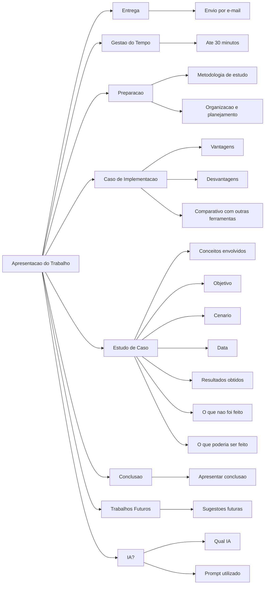

# Lembrando cronograma (atualizado)

| Datas | Conteúdo |
|---|---|
| 28/05 | Detalhamento de Seminários |
| 02/06 | **Prova II**|
| 28/05 a 11/06 | Preparação de Seminários |
| 16/06 | **Limite de envio de material por e-mail** |
| 18/06 e 30/06 | Apresentação de Seminários |
| 23/06 | Visita TOTVS |
--- 
# Detalhamento de Seminários
- [Detalhamento e orientações necessárias](https://canva.link/oicbpm0q93c46ce)

## Grupos e Temas escolhidos

 - Hugo, Vitor, Kelvin e Thiago - Modelos, Requisitos 
 - Henrique, Paulo e Tomas - Métodos Ágeis
 - Luis, José e Leonardo - Modelos e Processos
 - Arthur Israel, Brunno, Carlos e Felipe - Métodos Ágeis
 - Heloísa, Mirella, Guilherme e Maurício - Ética na Engenharia de Software
---
## Orientação e critérios

- Entrega no tempo hábil (até dia **12/06**) por e-mail 
- Gestão de tempo (até 30 minutos)
- Como fizeram os estudos e preparativos
- Caso de implmentação:
    - Vantagens e desvantagens de implementação 
    - Comparativo com as outras ferramentas existentes
- Estudo de Caso:
    - Conceitos envolvidos
    - Objetivo
    - Cenário apresentado
    - Data 
    - Resultados obtidos
    - O que não foi feito
    - O que poderiam ter feito
- Apresentar conclusão
- Comentar sobre trabalhos futuros
- Caso usou IA:
    - Qual IA
    - Prompt utilizado
---

## Apresentações no dia 18/06
- [Heloísa, Mirella, Guilherme e Maurício - Ética na Engenharia de Software](https://mehranmisaghi.github.io/ESW-I/seminarios/etica.pdf)
- [Hugo, Vitor, Kelvin e Thiago - Modelos, Requisitos](https://canva.link/ggo5uwr664fgsnd)

## Apresentações no dia 30/06
- [Luis, José e Leonardo - Modelos e Processos](https://mehranmisaghi.github.io/ESW-I/seminarios/modelos.pdf)
- [Henrique, Paulo e Tomas - Métodos Ágeis](https://canva.link/sotweou6djqq309)
- [Arthur Israel, Brunno, Carlos e Felipe - Métodos Ágeis](https://mehranmisaghi.github.io/ESW-I/seminarios/ESW.pdf)

